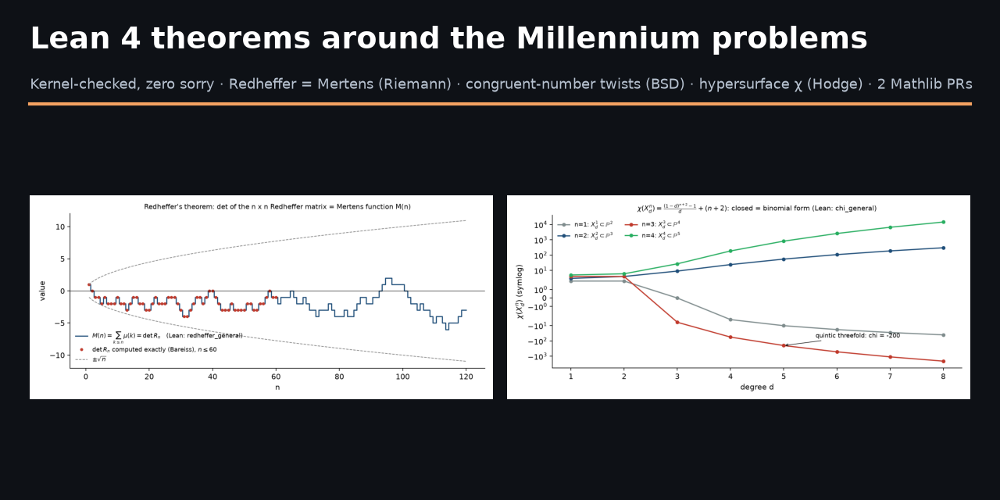
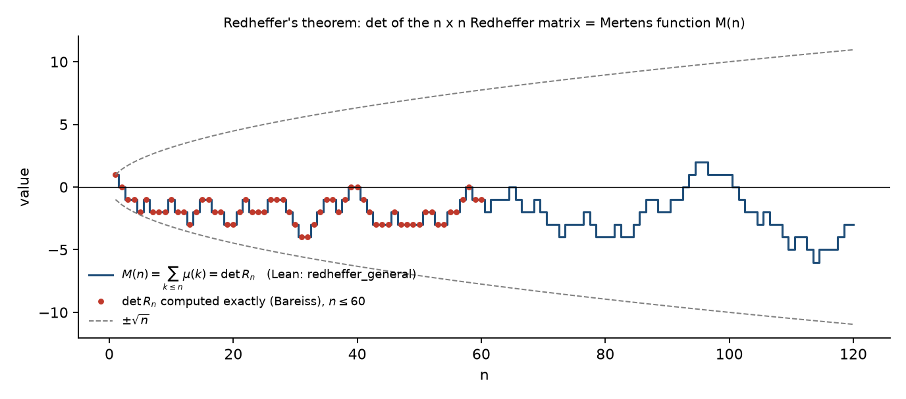
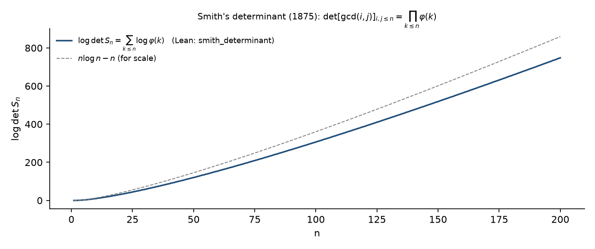
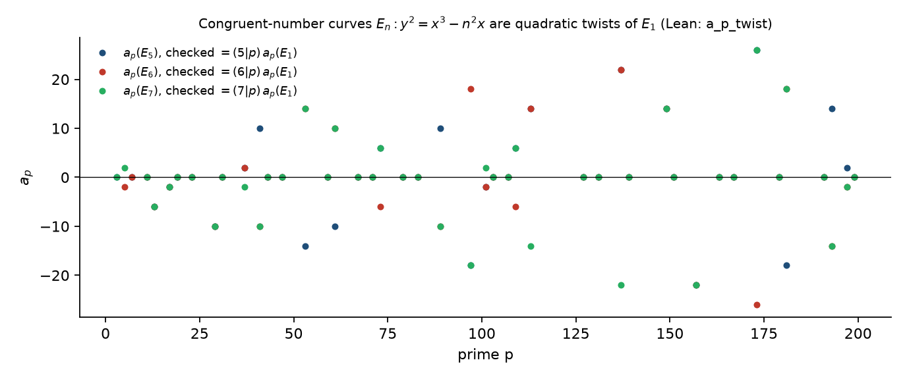
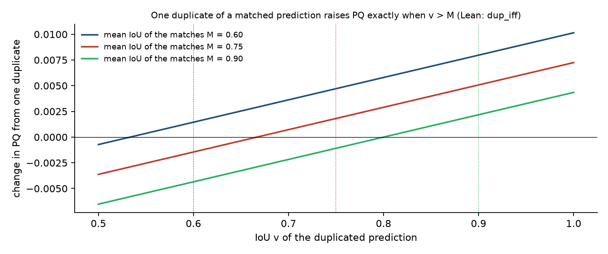

# Lean 4 theorems around the Millennium problems



Verified results in Lean 4 — number theory, arithmetic geometry and a metric.

Machine-checked theorems (Lean 4 + Mathlib, **zero `sorry`**, standard axioms only)
produced during an exploratory mathematics campaign in 2025–2026. Each file is a
self-contained formalization with a proof sketch in its header; two of the results
have been submitted to Mathlib.

**Scope, stated plainly.** Several of these results live in the neighbourhood of
Millennium Prize problems (the Riemann Hypothesis, Birch–Swinnerton-Dyer, Hodge).
None of them proves, or claims to make progress on, any Millennium problem. They are
classical or auxiliary statements — Redheffer's determinant identity, Smith's
determinant, a parity lemma for Tunnell's counts, the quadratic-twist formula for
congruent-number curves, Euler-characteristic identities for hypersurfaces — that
were previously unformalized (or not in Mathlib), now verified by the Lean kernel.

## Results

| File | Statement | Status |
|---|---|---|
| `RiemannRedheffer.lean` | **Redheffer (1977):** `det R_n = M(n)`, the Mertens function, for every `n ≥ 1` (`redheffer_general`). Also `det ζ_n = 1` for the divisibility matrix and a weighted variant. | Verified. Mathlib-style version in `mathlib-pr/Redheffer.lean`, submitted as [mathlib4#43758](https://github.com/leanprover-community/mathlib4/pull/43758). |
| `SmithDeterminant.lean` | **Smith (1875):** `det [gcd(i,j)] = ∏_{k≤n} φ(k)` (`smith_determinant`), and the general form `det [f(gcd(i,j))] = ∏ (f * μ)(k)` (`smithF_determinant`) with `σ`, `τ`, `σ_k` as corollaries. | Verified. |
| `SmithLCM.lean`, `SmithLCMForma.lean` | Smith's theorem over an arbitrary commutative ring and the determinant of `[lcm(i,j)]`, with its closed form via `Σ_{d∣n} μ(d) f(d) = ∏_{p∣n} (1 − f(p))`. | Verified. The identity for all `n` is `mathlib-pr/MoebiusProdPR.lean`, submitted as [mathlib4#43749](https://github.com/leanprover-community/mathlib4/pull/43749). |
| `BSDParidad.lean` | A finset with a fixed-point-free involution has even cardinality (`even_card_of_fixedPointFree_involution`); hence Tunnell's four representation counts for congruent numbers are always even (`tunnell_par`). | Verified. |
| `BSDTwist.lean` | For `E_n : y² = x³ − n²x`, `a_p(E_n) = (n/p) · a_p(E_1)` for `p ∤ 2n` (`a_p_twist`): the congruent-number curves are quadratic twists of `E_1`. | Verified. |
| `HodgeMathlib.lean` | `χ(X_d^n) = ((1−d)^{n+2} − 1)/d + (n+2)` for smooth degree-`d` hypersurfaces in `P^{n+1}`, closed form = binomial form (`chi_general`); Fano / Calabi–Yau / general-type criteria; genus–degree formula; Betti/Hodge bounds for surfaces. | Verified (polynomial identities via `ring`). |
| `Panoptic*.lean` | Exact theory of the Panoptic Quality metric used in the IEEE BigData Cup 2026 solar-filament challenge: when a duplicate raises the score (`pq_dup_iff`, `dup_iff`), no reweighting removes the defect (`ningun_peso_lo_arregla`), the candidate rule `p·j > PQ/2` (`pq_candidato_iff`), the two-annotator ceiling (`techo_dos_anotadores`), and that the threshold `1/2` is exact (`umbral_exacto`). | Verified. |

Axioms used by every main theorem: `propext`, `Classical.choice`, `Quot.sound` — checked with `#print axioms`.

## Documentation

One document per result, in English, with the statement, the proof as formalized, what is
classical and what is new, and references:

1. [Redheffer's theorem: `det R_n = M(n)`](docs/01-redheffer.md)
2. [Smith's determinant and its general form (`f(gcd)`, `lcm`, closed form)](docs/02-smith.md)
3. [Congruent numbers: parity of Tunnell's counts and the quadratic-twist formula](docs/03-congruent-numbers.md)
4. [Euler characteristic and Hodge numbers of smooth hypersurfaces](docs/04-hypersurfaces.md)
5. [The Panoptic Quality metric, exactly](docs/05-panoptic.md)
6. [Verifying the results, and the Mathlib contributions](docs/06-mathlib-and-verification.md)

## Figures

Each figure is generated by `scripts/make_figures.py` from first principles and
re-checks the theorem numerically before drawing it.










## Building

```bash
lake exe cache get   # Mathlib oleans for the pinned toolchain (see lean-toolchain)
lake build
```

The project pins `leanprover/lean4:v4.32.0` and Mathlib `v4.32.0`. The two files
under `mathlib-pr/` target Mathlib **master** (they use the `module` system and the
current lemma names) and are not part of the default build.

## How this was produced

The mathematics was directed by Joel Cruz Cabrera; the Lean code was written with
substantial help from an AI assistant (Claude, Anthropic) and every proof was checked
by the Lean kernel. Where a result is a known theorem, the original reference is
given in the file header; where the formalization appears to be new, the header says
so and to what extent that was checked (Mathlib search at the date of writing).

## License

Apache 2.0, to match Mathlib.
