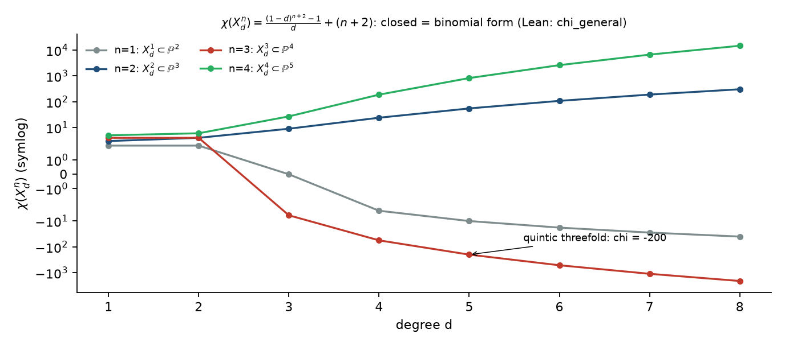

# Euler characteristic and Hodge numbers of smooth hypersurfaces

**File:** `HodgeMathlib.lean`.

Everything in this file is a polynomial or combinatorial identity about the classical
invariants of a smooth degree-`d` hypersurface `X_d^n ⊂ P^{n+1}` — the Euler characteristic,
the geometric genus, and (for threefolds) `h^{1,1}` and `h^{2,1}`. The Hodge conjecture is not
involved; these are the numbers one needs before one can even state examples for it.

## The unified formula for `χ`

For `X_d^n`, the Euler characteristic is

```
χ(X_d^n) = ((1 − d)^{n+2} − 1) / d + (n + 2)
         = Σ_{k=1}^{n+1} (−1)^{k+1} C(n+2, k+1) d^k .
```

Both forms appear in the literature; that they agree is a binomial identity, which is what
`chi_general` proves (multiplied through by `d` to stay in a ring):

```lean
theorem chi_general (d : ℚ) (n : ℕ) :
    (1 - d) ^ (n + 2) - 1 + ((n : ℚ) + 2) * d
      = ∑ k ∈ Finset.range (n + 1), ((n + 2).choose (k + 2) : ℚ) * (-d) ^ (k + 2)
```

Instances: surfaces `χ = d³ − 4d² + 6d` (`chi_n2`), threefolds `χ = 10d − 10d² + 5d³ − d⁴`
(`chi_n3_cerrada`), fourfolds (`chi_n4_cerrada`), and the quintic threefold `χ = −200`
(`quintica_chi_menos_200`).



## Geometric genus and the three types

With `pg m n = C(m − 1, n + 1)` the geometric genus of a degree-`m` hypersurface in `P^{n+1}`
(`m − 1` choose `n + 1`, the number of monomials of degree `m − n − 2` in `n + 2` variables):

| criterion | theorem |
|---|---|
| `pg = 0 ↔ m < n + 1` (Fano) | `fano_iff` |
| `pg = 1 ↔ m = n + 1` (Calabi–Yau) | `calabi_yau_iff` |
| `m ≥ n + 2 → pg ≥ 2` (general type) | `general_type` |
| quintic threefold and K3 are CY; cubic surface is Fano; sextic threefold is general type | `quintica_es_CY`, `k3_es_CY`, `cubica_es_Fano`, `sextica_tipo_general` |
| genus–degree formula for plane curves `g = (m−1)(m−2)/2` | `genus_degree` (and `genero_conica/cubica/cuartica/quintica`) |

## Surfaces: the Noether–Lefschetz window is OEIS A005581

For a smooth surface of degree `d` in `P^3`, the Noether–Lefschetz locus `NL_d` (surfaces with
Picard number `≥ 2`) has components whose codimension in `|O(d)|` lies between `d − 3`
(Green 1989, Voisin 1989; attained by surfaces containing a line) and the geometric genus
`p_g(d) = C(d−1, 3)`. The *window* `W(d) = p_g(d) − (d − 3)` was first compared numerically
(`d = 4 … 200`, exact rationals) with the OEIS entry [A005581](https://oeis.org/A005581),
`a(n) = (n−1) n (n+4) / 6`, and found to agree at `n = d − 3`. The file closes this for every
integer `d` as an identity of polynomials, stated without division (`×6`):

```
theorem ventana_es_oeis_A005581 (d : Int) :
    (d - 1) * (d - 2) * (d - 3) - 6 * (d - 3) = (d - 4) * (d - 3) * (d + 1)
```

It rests on `hodge_surface_betti` (`6 · h^{2,0} = (d−1)(d−2)(d−3)`) and on the lower bound
`cota_le_pg` / `cota_lt_pg` (`d − 3 ≤ p_g(d)`, strict for `d ≥ 4`; equality only for `d = 2, 3`,
`cota_eq_pg_iff`). The sequence itself is a long-standing OEIS entry (closed form `(n−1) n (n+4) / 6`); what is new is the identification of
the Noether–Lefschetz window with it, and the kernel-checked proof for all `d`. Preprint:
[10.5281/zenodo.21535860](https://doi.org/10.5281/zenodo.21535860).

## Threefolds: parity of `χ` and the mirror-symmetry number `h^{2,1}`

For a smooth hypersurface threefold, Lefschetz gives `b_0 = b_6 = 1`, `b_1 = b_5 = 0`,
`b_2 = b_4 = 1`, so `χ = 4 − b_3`. Since `b_3 = 2 h^{3,0} + 2 h^{2,1} = 2 (pg + h^{2,1})`, one gets
`h^{2,1} = (4 − χ)/2 − pg`, which only makes sense if `χ` is even. The file proves:

* `chi3_par`: `χ(X_d^3)` is even for every integer `d` (explicit witness, split by parity of `d`);
* `chiN_par`: more generally `χ(X_d^n)` is even for every **odd** `n` (via a computation in `ZMod 2`);
* `h21_quintica_de_formula_general`: `(4 − χ)/2 − pg = 101` for `d = 5` — the famous `h^{2,1} = 101`
  of the quintic threefold, derived from the general formula rather than quoted;
* `h11_integral`: the `h^{1,1}`-numerator is divisible by `3` (a `ZMod 3` computation), so the
  formula for `h^{1,1}` of the relevant family gives an integer for every `d`.

## What is new here

None of these formulas is new; they are in Hirzebruch's *Topological Methods* and in every
text on Calabi–Yau threefolds. What this file adds is that the closed form and the binomial
form are **proved equal for all `n`**, and the integrality/parity facts that textbooks assert by
inspection are checked for all `d` at once, in a kernel-verified way.

## References

* F. Hirzebruch, *Topological Methods in Algebraic Geometry*, 3rd ed., Springer (1978), §22.
* P. Candelas, X. de la Ossa, P. Green, L. Parkes, *A pair of Calabi–Yau manifolds as an exactly soluble superconformal theory*, Nucl. Phys. B 359 (1991) — `h^{1,1} = 1`, `h^{2,1} = 101` for the quintic.
